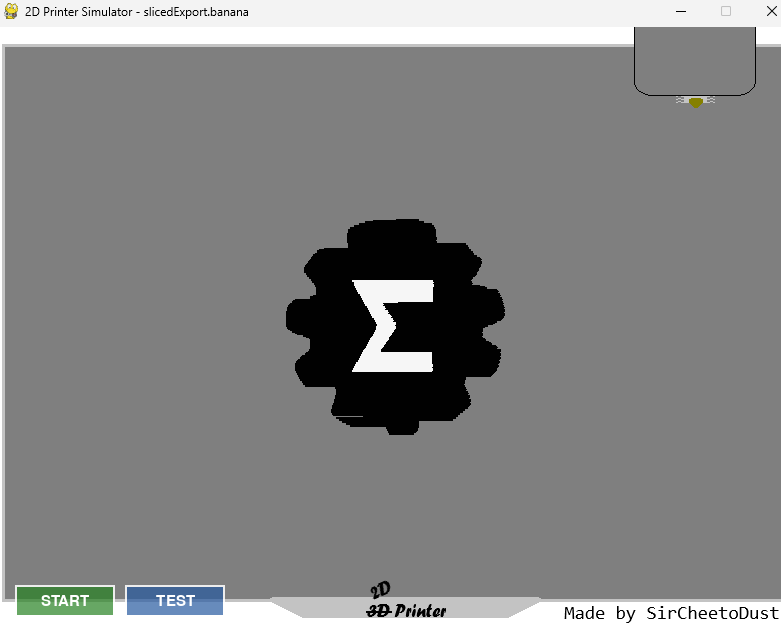
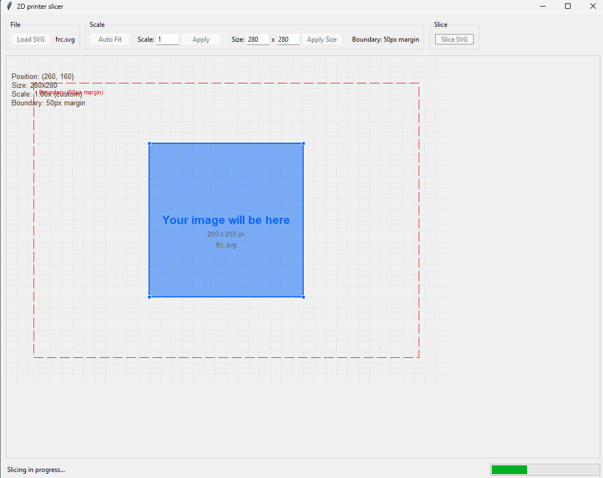

# 2D Printer Simulator
An app that allows you to "print" images on a 2D printer, complete with a slicer!


---
# Overview
## Features
### Printer
 - A custom printer instruction language
 - Real-time printer simulation
 - Multiple drawing colors
 - Polygon rendering
 - Filled polygon support (INFILL)
 - Animated print head
 - Command parser
 - Home positioning

### SVG Slicer
- Imports SVG files
- Converts SVG geometry into printer instructions
- Stroke support
- Polygon infill generation
- Color extraction
- Adjustable scaling
- Adjustable print offsets

## Instruction Language Guide

| Instruction | Description |
|----------|-------------|
| `HOME` | Return print head to home position |
| `MOVE X Y` | Move the print head(800x600 canvas) |
| `START` | Begin drawing |
| `END` | Stop drawing |
| `COLOR R G B` | Change drawing color |
| `INFILL` | Begin polygon infill operation(printhead speeds up) |
| `DRAW` | End infill mode(printhead will slow down) |

---
## Techstack
 - Python
 - Pygame
 - svgelements
 - NumPy
 - tqdm

# Quick Start
## If your lazy:
[Download a compiled version here](https://www.markdownguide.org](https://github.com/thecheetoman/2D-printer-simulation/releases/tag/Latest)
## Local Development

### 1. Clone the repository

```bash
git clone https://github.com/thecheetoman/2d-printer-simulator.git
cd 2d-printer-simulator
```

### 2. Create a virtual environment

Python 3.12–3.13 is recommended.

```bash
python -m virtualenv venv

# Windows
.\venv\Scripts\activate

# Linux / macOS
source venv/bin/activate

pip install -r requirements.txt
```

---

## Creating a Print File

Launch the slicer:

```bash
python ./src/slicer/main.py
```

### Using the slicer

1. Click **Load SVG**.
2. Select an SVG image to import.
3. Position the artwork using the X and Y offsets.
4. Adjust the scale until the artwork fits within the printer's 800×600 build area.
5. Click **Slice**.
6. Wait for the slicing process to finish. Complex SVGs can take a couple of minutes to process.
7. Save the generated `.banana` file.

---

## Simulating a Print

Launch the printer simulator:

```bash
python ./src/printer/main.py
```

### Using the printer

1. Click the **Load** button.
2. Select the `.banana` file generated by the slicer.
3. Press **Start** to simulate a normal print.
4. Press **Test** to perform a high-speed dry run without drawing (useful for verifying toolpaths and movement).
> Sometimes the printer may just start printing before randomly stopping, I cannot figure out what is causing that issue, so please relaunch the printer.

---

## Workflow

```text
SVG Artwork
     │
     ▼
Load into Slicer
     │
     ▼
Adjust Position & Scale
     │
     ▼
Slice
     │
     ▼
Generate .banana File
     │
     ▼
Load into Printer
     │
     ▼
Print Simulation
```

---

## Tips

- The printer's virtual build area is **800 × 600 pixels**.
- SVG files generally produce the best results when they contain vector paths rather than embedded raster images.
- Larger or more detailed SVGs will take longer to slice.
- The **Test** mode is useful for checking print paths without rendering the final drawing.
